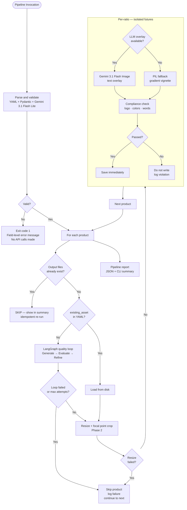

# Failure Modes Analysis: Creative Automation Pipeline POC

**Document Version:** 2.0
**Date:** 2026-04-23
**Status:** Active

---

## Overview

The pipeline is designed around a fail-partial, not fail-total philosophy. A single bad API response, a compliance violation, or a failed resize never aborts the entire campaign run. Each product is treated as an independent unit of work with its own failure boundary. Per-ratio work within a product is further isolated — one aspect ratio failing does not discard the others. The pipeline always produces the maximum number of assets it can given the inputs, reports clearly what succeeded and what did not, and remains fully restartable from any point via file-based idempotency.

---

## Failure Handling Flow

---

## Failure Classification

| Category | Likelihood | Impact | Severity | Auto-recover |
|---|---|---|---|---|
| Input / validation error | Medium | High — pipeline cannot start | P1 | No — fix the YAML |
| Missing source asset file | Medium | Low — falls back to AI generation | P3 | Yes |
| Disk full | Low | High — pipeline halts | P1 | No |
| Network timeout | Medium | Low — single product delayed | P3 | Future (tenacity) |
| Rate limit (429) | Low (POC) / Medium (production) | Low — transient delay | P3 | Future (tenacity) |
| Invalid API key (401) | Low | High — pipeline cannot proceed | P1 | No — fix credentials |
| Provider outage (5xx) | Low | Medium — product skipped | P2 | Partial — product skipped |
| LLM overlay failure | Medium | Low — PIL fallback used | P4 | Yes — auto fallback |
| Quality loop max attempts | Low | Medium — product flagged | P3 | No — human review |
| Compliance violation | Medium | Medium — asset not written | P3 | No — prompt review |
| Cascading API failures | Low | High — pipeline stalls | P1 | Future (circuit breaker) |

---

## Category 1 — Input Errors

Input errors are detected before any API call is made. The two-layer security check (Pydantic structural validation followed by Gemini 3.1 Flash Lite classification) runs first. Any failure here exits immediately with a field-level error message and exit code 1. No partial output is written. This category covers malformed YAML, missing required fields such as `campaign_id` or `products`, wrong field types, invalid hex colors in the brand palette, and unknown extra fields rejected by `extra='forbid'`. The user-facing error identifies the offending field and expected type so the YAML can be corrected without trial and error.

Missing source asset files are a special case: if `existing_asset` in the YAML points to a path that does not exist, the pipeline logs a warning and falls back to AI generation for that product rather than halting. A zero-byte file is treated as missing. This avoids a hard stop for what is typically a stale path reference.

---

## Category 2 — System Errors

System errors relate to the host machine rather than the AI providers. Disk exhaustion is caught by a pre-flight check at pipeline start that estimates required space from the campaign brief (products × regions × ratios × 5 MB) and exits before any generation begins if headroom is insufficient. During a run, an `OSError` on write halts the pipeline and lists which assets succeeded so the operator knows where to resume.

Memory exhaustion during image processing is handled by processing products sequentially and explicitly releasing PIL Image objects after each product. For the POC scale (up to 5 products × 3 ratios × ~5 MB each) this is sufficient. At production scale, Kubernetes memory limits and pod autoscaling are the appropriate controls.

---

## Category 3 — API Errors

The POC connects to a single Google AI endpoint using one `GOOGLE_API_KEY`. API key errors (401) fail immediately and do not retry — a bad key will not become valid on retry. The key is validated at startup before any generation begins.

Rate limit errors (429) were encountered during POC development but were caused by billing credits being depleted rather than by genuine request-rate limiting. Adding retry logic would not have helped in that scenario. At production scale, sustained RPM will hit genuine rate limits and tenacity-based retry with exponential backoff is the correct response. This is captured in FUTURE_SCOPE.md.

Provider-side errors (5xx) and LLM overlay failures each degrade gracefully: a 5xx during the quality loop causes the product to be skipped; a failure in `llm_overlay.add_text_overlay_llm` triggers the PIL gradient vignette fallback so the asset is still produced, at lower compositional quality.

---

## Category 4 — Quality Errors

Quality errors are detected by two mechanisms: the LangGraph quality loop and the post-composition compliance checker. In the quality loop, Gemini 3 Flash scores each generated image 0-5 against the brand brief. If the score falls below the acceptance threshold and the maximum refinement attempts have been reached, the product is flagged for human review and skipped — it is not blocked, just deferred.

After composition, the compliance checker runs three deterministic checks: logo presence (template match confidence ≥ 0.85), brand color coverage (≥ 15% of pixels within the brand palette), and prohibited words (zero tolerance, whole-word regex). Any failure here means the asset is not written to disk; the violation details are logged so the creative team can diagnose whether the issue is in the prompt, the overlay text, or the brand config.

Text legibility is the fourth quality check. The LLM overlay adds text holistically, but if the Gemini call fails and the PIL fallback is used, the vignette ensures sufficient contrast. A critical contrast ratio below 3.0:1 is a hard compliance block; the WCAG AA threshold of 4.5:1 triggers an auto-fix (dark background pill behind text) but does not block the asset.

---

## Category 5 — Composition Errors

Composition errors occur in Phase 2 (resize) and the per-ratio overlay step. Phase 2 failures are caught at the product level: if smart crop fails for any reason, the product is skipped entirely and the pipeline continues. Per-ratio failures in the `ThreadPoolExecutor` are isolated per future — a crash in the 9:16 future does not cancel the 1:1 and 16:9 futures for the same product. Partial saves (e.g. two of three ratios completed before a failure) are accepted; the idempotency check on re-run will pick up only the missing ratio.

---

## Category 6 — Scale Failures

Scale failures are not applicable at POC scale (sequential single-user CLI) but are documented here for the production transition. Concurrent write conflicts arise when multiple workers attempt to write to the same output path simultaneously. The current file-based idempotency check is not atomic and does not protect against this. The production solution is Redis distributed locking keyed on `{campaign_id}:{product}:{region}:{ratio}` combined with assigning disjoint product subsets to each Kubernetes worker pod.

Cascading API failures — where every product in a campaign hits the same provider outage — are not handled with a circuit breaker in the POC. The current behavior is that each product logs its failure and the pipeline completes with a low asset count. A circuit breaker that opens after N consecutive failures, halts the run, and reports the partial state cleanly is the production-appropriate response. See FUTURE_SCOPE.md.

---

## Failure Mode Registry

| ID | Category | Failure | Likelihood | Impact | Severity | Auto-recover |
|---|---|---|---|---|---|---|
| FM-01 | Input | Invalid YAML syntax | Medium | High | P1 | No — fix YAML |
| FM-02 | Input | Missing required field | Medium | High | P1 | No — fix YAML |
| FM-03 | Input | Wrong field type | Low | High | P1 | No — fix YAML |
| FM-04 | Input | Missing source asset file | Medium | Low | P3 | Yes — fallback to AI generation |
| FM-05 | System | Disk space exhausted | Low | High | P1 | No — free disk space |
| FM-06 | System | Network timeout | Medium | Low | P3 | Future — tenacity retry |
| FM-07 | System | Memory exhaustion | Low | High | P2 | Partial — sequential processing |
| FM-08 | API | Rate limit (429) | Low (POC) | Low | P3 | Future — tenacity retry |
| FM-09 | API | Invalid API key (401) | Low | High | P1 | No — fix credentials |
| FM-10 | API | Provider outage (5xx) | Low | Medium | P2 | Partial — product skipped |
| FM-11 | API | LLM overlay failure | Medium | Low | P4 | Yes — PIL fallback |
| FM-12 | Quality | Quality loop max attempts | Low | Medium | P3 | No — human review |
| FM-13 | Quality | Compliance — brand colors | Medium | Medium | P3 | No — prompt review |
| FM-14 | Quality | Compliance — logo not detected | Medium | Medium | P3 | No — brand config review |
| FM-15 | Quality | Compliance — prohibited word | Low | High | P2 | No — fix campaign message |
| FM-16 | Quality | Text contrast below 3.0:1 | Low | Medium | P3 | No — asset not written |
| FM-17 | Composition | Phase 2 resize failure | Low | Medium | P2 | Partial — product skipped |
| FM-18 | Composition | Per-ratio overlay failure | Low | Low | P4 | Yes — other ratios continue |
| FM-19 | Scale | Concurrent write conflict | Not applicable (POC) | Medium | P2 | Future — Redis lock |
| FM-20 | Scale | Cascading API failures | Low | High | P1 | Future — circuit breaker |

---

*Update this registry after each incident or test run that reveals a new failure mode.*
