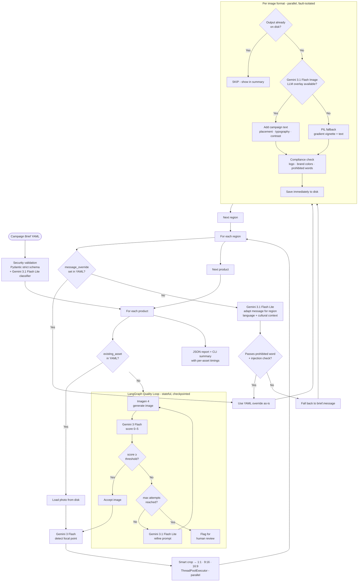

# Creative Automation Pipeline: POC

A Python CLI tool that transforms a declarative campaign brief (YAML) into a complete set of brand-compliant social ad creatives. Given products, target regions, a campaign message, and an audience definition, the pipeline resolves or generates product imagery, adapts copy per region, adds campaign text via LLM image editing, runs automated brand compliance checks, and emits a structured JSON report, all from a single command.

---

## How It Works



**LangGraph quality loop** governs AI image generation. Prompt, image bytes, score, and attempt count are checkpointed after each node (`MemorySaver`). A mid-loop crash resumes from the last completed node, with no Imagen re-call and no wasted credits.

**LLM text overlay** is the primary composition path. Gemini 3.1 Flash Image receives the product photo and creative direction, and renders the campaign message directly into the image, handling placement, typography, contrast, and blending as one holistic creative decision. When this call fails, PIL gradient vignette is applied automatically as a code-based fallback.

---

## Quick Start

### Prerequisites

- Python 3.11 or higher
- `GOOGLE_API_KEY` - one key covers all four models (Imagen 4, Gemini 3 Flash, Gemini 3.1 Flash Lite, Gemini 3.1 Flash Image)

### Installation

```bash
git clone https://github.com/ishween/SocialCampaignGenAI.git
cd SocialCampaignGenAI

python -m venv .venv
source .venv/bin/activate        # macOS / Linux
pip install -r requirements.txt
```

### Environment Setup

```bash
# .env at project root is auto-loaded by main.py
echo 'GOOGLE_API_KEY=your-key-here' > .env
```

---

## Run Modes

| Config | What it tests | Command |
|---|---|---|
| `test_existing_asset.yaml` | Existing product photo → LLM overlay → compliance. Zero Imagen calls. Fast. | `python src/main.py --brief config/test_existing_asset.yaml` |
| `test_generate_asset.yaml` | Full generation path: LangGraph quality loop → Imagen 4 → LLM overlay → compliance | `python src/main.py --brief config/test_generate_asset.yaml --generator imagen` |
| `poc_campaign.yaml` | Both paths together: 1 existing asset + 1 generated image, 2 products × 3 ratios | `python src/main.py --brief config/poc_campaign.yaml --generator imagen` |
| `poc_campaign.yaml` (native ratios) | Same as above but Imagen 4 generates each ratio natively in parallel, with no crop/resize step | `python src/main.py --brief config/poc_campaign.yaml --generator imagen --native-ratios` |

---

## CLI Arguments

| Argument | Required | Default | Description |
|---|---|---|---|
| `--brief` | Yes | - | Path to campaign brief YAML. |
| `--output` | No | `./output` | Output directory. Created automatically. |
| `--assets` | No | `./assets/input` | Directory scanned for existing product images. |
| `--brand-config` | No | `./config/brand_config.yaml` | Brand colors, logo, font, prohibited words. |
| `--generator` | No | `auto` | `auto` = Gemini Flash Image (works with any API key). `imagen` = Google Imagen 4 (requires billing). |
| `--quality-threshold` | No | `3.5` | Minimum quality score (0–5) to accept a generated image. |
| `--max-attempts` | No | `3` | Maximum generate → evaluate → refine iterations before flagging for human review. |
| `--native-ratios` | No | off | Generate one natively-composed image per aspect ratio in parallel instead of generating a single 1:1 base and resizing. Produces better-composed images at 3× the generation cost (~$0.06 vs ~$0.02). No effect for products with `existing_asset`. |
| `--log-level` | No | `INFO` | `DEBUG` \| `INFO` \| `WARNING` \| `ERROR` |

**Exit codes:** `0` = all assets produced · `1` = crash or invalid brief · `2` = partial failure

---

## Input Structure

A campaign brief is a single YAML file. It defines what to make, who it is for, and the brand rules that govern output. The pipeline validates the brief (Pydantic schema + Gemini safety classifier) before making any API calls.

### Campaign Brief Format

```yaml
name: "HydraFresh Existing Asset Test"
message: "Stay Fresh. Stay Hydrated."
target_audience: "Health-conscious adults aged 25-40 who lead active lifestyles"
brand_style: "vibrant, energetic, outdoor lifestyle, clean and modern"

products:
  - name: "Hydrate+"
    description: "Performance electrolytes and recovery support, lemon lime flavor"
    existing_asset: "assets/input/Hydrate.png"   # present → skips LangGraph + Imagen
    style_keywords:
      - "clean"
      - "lifestyle"

regions:
  - code: "US"
    language: "en"
    locale_name: "United States"

aspect_ratios:
  - "1:1"    # 1080 × 1080 - Instagram feed, Facebook
  - "9:16"   # 1080 × 1920 - Stories, TikTok, Reels
  - "16:9"   # 1920 × 1080 - YouTube, display banners

prohibited_words:
  - "guaranteed"
  - "cure"
  - "miracle"
```

### Generation-path fields

When `existing_asset` is `null`, the product enters the LangGraph quality loop. Two optional fields guide the Imagen 4 prompt:

| Field | Purpose |
|---|---|
| `label_text` | Text to render on the product label in the generated image. Use `\n` for line breaks. Instructs the model to integrate the text into the product design, not as a post-process overlay. |
| `background_scene` | Lifestyle or scene context placed behind the product (e.g. sports stadium, kitchen counter). Null = clean studio background. |

```yaml
products:
  - name: "HydraFresh Sport Bottle"
    description: "Sleek 32oz BPA-free insulated stainless steel water bottle..."
    existing_asset: null
    label_text: "HydraFresh\nSport\n32 oz\nDouble-Wall Insulated"
    background_scene: >
      dynamic sports stadium at dusk, crowd cheering, dramatic floodlights,
      water droplets frozen mid-air, cinematic depth of field
```

### Per-region message adaptation

If `message_override` is set, it is used as-is. If it is not set, Gemini 3.1 Flash Lite automatically adapts `brief.message` for the region's language and cultural context. The adapted message is validated against `prohibited_words` and security injection patterns before use. If validation fails, the original `brief.message` is used as fallback.

```yaml
regions:
  - code: "US"
    language: "en"
    locale_name: "United States"
    # no override → brief.message used directly (English, no adaptation needed)

  - code: "FR"
    language: "fr"
    locale_name: "France"
    # no override → Gemini 3.1 Flash Lite adapts brief.message to French

  - code: "DE"
    language: "de"
    locale_name: "Germany"
    message_override: "Bleib Frisch. Bleib Hydriert."
    # override set → used as-is, no LLM call
```

---

## Brand Config Format

```yaml
name: "HydraFresh"
logo_path: "assets/brand/logos/hydrafresh_logo.png"   # PNG with alpha channel

primary_colors:
  - "#00A8E8"   # HydraFresh Blue
  - "#00CC66"   # HydraFresh Green
  - "#FFFFFF"   # White

font_path: null          # null → system Helvetica / DejaVu fallback
font_size_base: 52
text_color: "#FFFFFF"
text_shadow: true
```

| Field | Type | Description |
|---|---|---|
| `logo_path` | string | PNG with transparency, checked in compliance step |
| `primary_colors` | list[hex] | Brand palette, ≥ 15% pixel coverage required to pass compliance |
| `font_path` | string \| null | TTF/OTF for PIL fallback overlay, null = system font |
| `text_color` | hex | Overlay text color for PIL fallback |
| `text_shadow` | bool | Multi-layer drop shadow behind text for readability |

---

## Output Structure

```
output/
├── hydrate+/
│   └── us/
│       ├── 1x1.png      # 1080 × 1080
│       ├── 9x16.png     # 1080 × 1920
│       └── 16x9.png     # 1920 × 1080
├── hydrafresh_sport_bottle/
│   └── us/
│       ├── 1x1.png
│       ├── 9x16.png
│       └── 16x9.png
├── pipeline_report.json
└── pipeline.log
```

---

## AI Models

All models share a single `GOOGLE_API_KEY`. The pipeline uses the right-sized model for each task rather than routing everything through the most capable (and expensive) model. Image synthesis needs a dedicated generation model, quality evaluation needs multimodal vision, and text-only tasks like prompt refinement and safety classification need speed over power. See `Trade_OFF.md` §5 for the full provider and model selection rationale.

| Task | Model | Notes |
|---|---|---|
| Image generation | Imagen 4 (`imagen-4.0-generate-001`) | Dedicated synthesis model, not a general LLM. Chosen for IP indemnification and photorealism. ~$0.02/image. |
| Quality scoring + focal point detection | Gemini 3 Flash (`gemini-3-flash-preview`) | Vision input → numeric score (0–5) + pixel coordinates. Multimodal, fast enough for up to 3 evaluation rounds per product. |
| Prompt refinement · safety classification · region message adaptation | Gemini 3.1 Flash Lite (`gemini-3.1-flash-lite-preview`) | Text-only tasks needing speed over power. ~5× cheaper than Flash. Right-sized for binary classification and short-text rewriting. |
| LLM text overlay | Gemini 3.1 Flash Image (`gemini-3.1-flash-image-preview`) | Image-in → image-out. Adds campaign text as one holistic creative decision, with placement, typography, and contrast handled together rather than in separate steps. |

---

## Fault Tolerance

*PIL (Python Imaging Library) is the code-based image processing layer used as a fallback when Gemini image editing is unavailable.*

| Mechanism | What it protects |
|---|---|
| Asset resolution failure | If a product photo cannot be loaded and AI generation also fails, that product is skipped and the pipeline continues to the next one. |
| Resize failure | If smart cropping fails for a product (e.g. corrupt image), that product is skipped cleanly without affecting others. |
| Each image format runs independently | 1:1, 9:16, and 16:9 each run in separate parallel threads. A failure in one format does not cancel the others. Partial output is accepted. |
| Save immediately | Each creative is written to disk right after overlay and compliance complete, not at the end of the run. A crash mid-run leaves all previously completed formats intact. |
| Idempotency | If an output file already exists on disk, all API calls for that creative are skipped. Re-running after a crash only rebuilds what is missing. Shown as `[SKIP]` in the summary. |
| LLM overlay → PIL fallback | When Gemini image editing fails (429, 5xx, empty response), PIL gradient vignette + text is applied in code. The asset is still written, visual quality is lower but the run completes. |
| LangGraph MemorySaver | If the quality evaluator crashes after Imagen 4 has already generated an image, resuming the pipeline reloads the image from the in-process checkpoint rather than calling Imagen 4 again. |
| Region message validation | If LLM-adapted copy contains a prohibited word or injection pattern, it is discarded and the original brief message is used. The asset is never blocked by bad auto-generated copy. |

---

## Documentation

| Document | Description |
|---|---|
| [Trade_Off.md](Trade_Off.md) | Every major design decision with alternatives considered and reasons for the choice |
| [SPIKE_DOC.md](SPIKE_DOC.md) | Full design doc: architecture, model selection, prompt strategy, fault tolerance |
| [FUTURE_SCOPE.md](FUTURE_SCOPE.md) | 11 production items deferred from POC (retry, persistent checkpointing, etc.) |
| [FAILURE_MODES.md](FAILURE_MODES.md) | Failure classification, handling flowchart, failure mode registry |
| [EVALUATION_STRATEGY.md](EVALUATION_STRATEGY.md) | Evaluation tiers, human review rubric, business metrics baseline |
