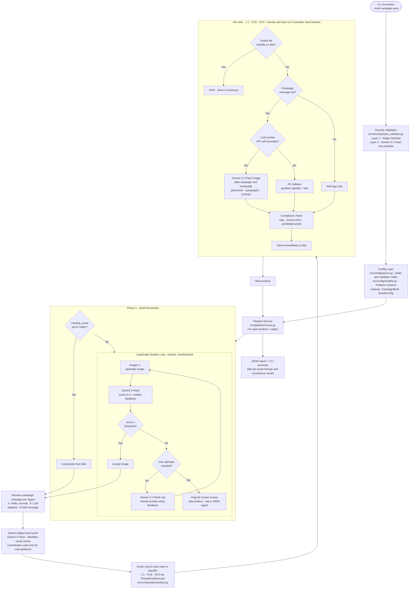

# Creative Automation Pipeline: Design Spike

---

## 1. Business Context

### 1.1 Problem Statement

Creative teams at enterprise customers are bottlenecked on asset production. Generating campaign-ready images for multiple products, regions, and channel aspect ratios is a manual, repetitive process involving design tools, external vendors, and multiple review cycles. This POC explores whether a Python CLI pipeline backed by generative AI can eliminate the mechanical production step, freeing creative team members to focus on strategy and quality review.

---

### 1.2 Pain Points in Enterprise Campaign Production

1. **Volume mismatch.** 250 campaigns/month × 3 ratios × 5 products = 3,750 assets/month. Creative teams of 5–20 cannot produce at this scale manually without compromising speed, quality, or both.

2. **Repetitive mechanical work.** Resizing, cropping, text placement, logo application, and export are mechanical steps that consume senior creative time. This work is rule-based and predictable, making it a strong candidate for automation.

3. **Multi-region localization bottleneck.** Adapting copy for each market (language, cultural context, regulatory constraints) requires specialist knowledge and creates sequential dependencies between the central team and regional stakeholders.

4. **Inconsistent brand compliance.** Human error in applying brand guidelines across vendors and time zones leads to off-brand assets reaching review, or worse, publication. A single source of truth for brand rules is rarely enforced programmatically.

5. **Slow iteration cycles.** Each revision cycle (brief → design → review → export → DAM upload) takes hours to days. When campaign strategy changes, assets need to be updated fast. Manual handoffs at each stage multiply latency.

---

### 1.3 What This POC Addresses

| Pain Point | What the pipeline does |
|---|---|
| Volume mismatch | Parallel ratio composition via `ThreadPoolExecutor`. A 5-product, 3-region campaign produces 45 assets in under 10 minutes. |
| Repetitive mechanical work | Imagen 4 generates the base product image. Gemini 3.1 Flash Image places campaign text holistically. PIL handles the fallback, with no manual design tools. |
| Localization bottleneck | Gemini 3.1 Flash Lite adapts campaign copy per region automatically. `message_override` in the YAML brief allows markets to lock in exact copy. |
| Brand compliance | Deterministic compliance checker (logo presence, brand color coverage, prohibited word scan) runs on every asset before it is written to disk. A non-compliant asset is never saved. |
| Slow iteration | YAML brief → full asset set in minutes. The LangGraph quality loop automates generate → evaluate → revise without human involvement until review. |

---

### 1.4 What Are DAMs?

A **Digital Asset Management (DAM)** system is the centralized platform where enterprises store, organize, retrieve, and distribute creative assets, including images, videos, copy, and brand guidelines. Campaign-ready assets live in the DAM. Downstream teams (social, paid media, web) pull directly from it for campaign assembly.

Examples: Adobe Experience Manager (AEM), Bynder, Cloudinary.

Currently the pipeline writes to the local filesystem (`output/{product}/{region}/{ratio}.png`) as a proxy for DAM delivery. In production, the final step after compliance passes would push the asset to the DAM via API, making it immediately available without a manual upload handoff. See `FUTURE_SCOPE.md §11` for the integration design.

---

### 1.5 Scoping Questions and Answers

| Question | Answer | Implication |
|---|---|---|
| How many campaigns per month? | ~250 campaigns/month | ~8-10 campaigns/day, batch cadence is appropriate |
| How many products per campaign? | 2-5 products | Max ~1,250 product+campaign combinations/month |
| How many aspect ratios per product? | 3 (1:1, 9:16, 16:9) | Max ~3,750 generated assets/month |
| How many regions per campaign? | Typically 1-3 | At 3 regions × 3 ratios × 5 products: 45 assets/campaign |
| Who are the users? | 5-20 creative team members | No multi-tenancy required at POC scale |
| What is acceptable end-to-end latency? | 5-10 min for a full batch campaign | Async/queue not required for POC |
| What notification mechanism is needed? | CLI output in POC | Webhooks or email in production |
| What availability SLA is expected? | Best-effort for POC, **99.5%** for production | Appropriate for a batch creative tool where campaigns are planned days in advance and the system is not customer-facing real-time |
| Does the pipeline need to be idempotent? | Yes. Re-runs should not regenerate existing assets. | Asset existence check is a first-class requirement |
| What happens when an image is off-brand? | Fail fast with clear error. Do not overwrite reviewed assets. | Compliance check gates file write |

---

## 2. Assumptions and Constraints

### 2.1 Asset Sizing Assumptions

| Ratio | Dimensions (px) | Typical Use Case | Approx. File Size (PNG) |
|---|---|---|---|
| 1:1 | 1080 × 1080 | Instagram feed, Facebook | 2-4 MB |
| 9:16 | 1080 × 1920 | Stories, TikTok, Reels | 3-5 MB |
| 16:9 | 1920 × 1080 | YouTube, display ads, web banners | 3-5 MB |

**Total per campaign (worst case):** 5 products × 3 regions × 3 ratios × 5 MB = 225 MB output
**Monthly storage requirement:** 250 campaigns × 225 MB = ~55 GB uncompressed. JPEG/WebP would reduce this by 3-5x.

**Decision:** PNG is used in POC for lossless quality during review. Production pipeline should add a JPEG/WebP conversion step before delivery to downstream DAMs.

### 2.2 User Scale Assumptions

- **Concurrent users (POC):** 1-3. Sequential CLI runs. No concurrency handling required.
- **Concurrent users (production):** Up to 20. Requires task queue and distributed locking on output paths.
- **Interface:** CLI for POC. API or UI for production.
- **Skill level:** Technical creative operations team, comfortable with YAML and CLI.

### 2.3 Constraints

- **Network:** Pipeline requires outbound internet access to Google AI endpoints only (`GOOGLE_API_KEY`). All active models share the same key and SDK.
- **Local filesystem:** Output written to `output/{product}/{region}/{ratio}.png`. Disk space must be pre-checked.
- **API keys:** Loaded from environment variables. No credential storage in code.

---

## 3. System Design

### 3.1 Tech Stack

| Component | Technology | Purpose |
|---|---|---|
| Language | Python 3.11+ | Core runtime |
| Schema / validation | Pydantic v2 | CampaignBrief, BrandConfig, strict field validation |
| Config serialization | PyYAML | YAML → Pydantic model loading |
| Quality loop | LangGraph + MemorySaver | Stateful Generate → Evaluate → Refine graph with per-node checkpointing |
| Image generation | Google Imagen 4 (`imagen-4.0-generate-001`) | Primary image synthesis. IP-safe. |
| Image evaluation | Gemini 3 Flash (`gemini-3-flash-preview`) | Quality scoring 0-5, focal point detection |
| Prompt refinement / input validation | Gemini 3.1 Flash Lite (`gemini-3.1-flash-lite-preview`) | Prompt rewriting and binary safety classification. Fast and cheap. |
| LLM text overlay | Gemini 3.1 Flash Image (`gemini-3.1-flash-image-preview`) | Holistic campaign text added to image via LLM image editing |
| Image processing | Pillow / PIL | Resize, smart crop, PIL fallback gradient vignette overlay |
| Parallel composition | ThreadPoolExecutor | Concurrent resize and overlay across all three aspect ratios |
| Testing | pytest | Unit tests across all layers |

---

### 3.2 POC Data Flow

#### Diagram notes

**Phase 1: Asset Resolution**
If `existing_asset` is set in the YAML brief, the product photo is loaded directly from disk with no generation step. If it is not set, the LangGraph quality loop runs to generate the image.

**LangGraph quality loop: max attempts and flag for human review**
The quality loop is not a retry mechanism for API errors. It is an iterative creative loop:
- Imagen 4 generates an image from the current prompt
- Gemini 3 Flash scores the image 0–5 and returns natural-language feedback (e.g., *"product too small in frame, background dominates"*)
- If the score meets the threshold, the image is accepted
- If not, and attempts remain, Gemini 3.1 Flash Lite rewrites the prompt to address the feedback, and Imagen 4 generates again

*Flag for human review* is triggered when the maximum number of iterations is reached without the score meeting the threshold. It is not a UI feature. It means the product is skipped and written to the JSON report as `flagged_for_review: true`. A creative team member can see which products need manual intervention from the report summary.

**Refine prompt: how prompts are improved**
`src/generation/prompt_refiner.py` sends three inputs to Gemini 3.1 Flash Lite: the current prompt, the evaluation feedback from Gemini 3 Flash, and the product description. The model rewrites the prompt to specifically address the critique, adding composition instructions, adjusting style language, or emphasising product placement. The refined prompt is used for the next generation attempt.

**Focal point detection: image crop only**
Gemini 3 Flash detects the visual centre of the product image (e.g., the focal point of a bottle on a table). These coordinates are used exclusively to guide the smart crop, so that when the image is resized to 9:16 or 16:9, the product stays centred rather than being cropped out. Focal point detection has no connection to campaign message resolution. The campaign message is resolved separately from the YAML brief or via LLM adaptation.

**Per-ratio - resize and overlay in parallel**
After the focal-point-guided crop produces a sized image for each ratio (1:1, 9:16, 16:9), all three ratios' overlay, compliance, and save steps run concurrently in separate threads. A failure in one ratio (e.g., the 9:16 LLM overlay times out) does not affect the 1:1 or 16:9 results. Partial output is accepted.

**LLM overlay: what "API call succeeds" means**
Whether to add a campaign message at all is decided before the overlay branch. If `message` is empty, only the logo is added and overlay is skipped entirely. The `OVR` diamond in the diagram represents whether the *Gemini 3.1 Flash Image API call succeeds*. If it returns an error (rate limit, server error, safety filter rejection), the PIL gradient vignette is used as a code-based fallback. The asset is always written. Visual quality is lower with the fallback but the pipeline completes.

---

## 4. Prompt Engineering Approach

### 4.1 Structured Prompt Template

Prompts are model-specific and assembled in `src/generation/prompt_builder.py`. Imagen 4 responds well to descriptive natural language with explicit style and composition direction. The module assembles prompts from a structured template rather than free-form strings, ensuring consistency, auditability, and safe defaults.

### 4.2 Prompt Versioning

Prompt templates are stored in `src/config/prompts.yaml` and versioned alongside the codebase. Each generated asset records the prompt version in its metadata for reproducibility and audit.

### 4.3 Seed Management

Seed management means using a fixed numeric seed when calling the image generation API so that the same prompt reliably produces the same image. In the POC, a random seed is used and logged per asset. In production, the seed should be derived deterministically from `hash(product + region + campaign_id)` so that any re-run of the same brief produces identical output, which is essential for auditability and detecting when a brief change has actually changed the output.

### 4.4 Future Scope: Prompt Gateway

The current prompt is built programmatically from a fixed template. At enterprise scale this becomes a limiting pattern:

- Different product categories need different prompt styles (lifestyle vs studio, premium vs mass-market)
- Model updates require prompt adjustments without code changes
- When a fallback model is needed (e.g., Imagen 4 quota exhausted), a compatible prompt variant must be available to avoid quality degradation, as prompts are model-specific
- Multiple brand teams should be able to contribute approved prompts through a governed interface rather than modifying code

The production solution is a **prompt gateway**, a versioned registry where operators select, A/B test, and promote prompts per brand, campaign type, and target model. A prompt can be tested against a small asset batch before being promoted to the full campaign. The gateway also enables model-agnostic fallback. When the primary model is unavailable, the gateway serves the appropriate prompt variant for the fallback model automatically.

---

## 5. Guardrails and Safety

### 5.1 Content Safety: Three Layers

**Layer 1: Input guardrails (prompt-level exclusions)**
Before Imagen 4 is called, `prompt_builder.py` assembles the prompt to explicitly exclude unwanted content, for example no text rendered in the scene unless `label_text` is set, no competitor logos, and no people unless a sports background is requested. These are natural-language instructions in the prompt itself, not API-level parameters. They steer the model away from outputs the compliance checker would later reject.

**Layer 2: Provider-level safety (Imagen 4 API)**
Google's Imagen 4 enforces safety policies at the API level before returning any image bytes. The pipeline sets `safety_filter_level: block_low_and_above` and `person_generation: allow_adult` (sports backgrounds may include athletes). If Imagen 4 rejects a prompt, no image is returned, the quality loop logs the failure as a generation error, and the attempt counts against the max-attempts limit.

**Layer 3: Post-composition compliance (deterministic checker)**
After the image is generated and campaign text is added, `src/compliance/checker.py` runs three deterministic checks: logo presence (template match, confidence > 0.85), brand color coverage (HSV histogram, >15% pixels within palette), and prohibited word scan (regex). A failed check prevents the asset from being written to disk. The compliance result is recorded in the JSON report regardless of pass or fail.

### 5.2 Brand Compliance Checks

| Check | Method | Threshold |
|---|---|---|
| Logo presence | Template match (OpenCV) | Confidence > 0.85 |
| Brand color coverage | HSV histogram comparison | >15% pixels within brand palette |
| Prohibited words | Regex match on overlay text | Zero tolerance |
| Image not blank | Mean pixel intensity | Std deviation > 10 |
| Safe area margins | Bounding box of text | 5% margin from all edges |

### 5.3 What Compliance Does Not Catch

- **Semantic brand alignment:** Addressed by the LangGraph quality loop. Gemini 3 Flash scores each generated image on brand alignment (0–5) before composition. This is LLM-as-judge, already implemented.

- **CLIP score:** CLIP measures cosine similarity between image and text embeddings using a shared encoder (e.g., OpenAI CLIP, OpenCLIP). Calculating it requires direct access to a CLIP model's weights, either a local open-source model or a self-hosted instance. The Gemini API does not expose embeddings in a format compatible with standard CLIP evaluation. If added to the production evaluation pipeline, CLIP would run locally against saved output images using an open-source model (e.g., `openai/clip-vit-base-patch32`), not via the Gemini API. Added to production roadmap.

- **Accessibility:** Alt-text generation is not implemented in the POC.

- **Legal review:** Product depictions in regulated industries (pharmaceuticals, financial services, alcohol) require human legal sign-off. A production extension would flag the asset, send a notification (email, Slack webhook, or ticketing system), and persist the pipeline state. On approval or rejection received via webhook, the pipeline resumes, accepting the asset to the DAM or discarding it. This follows the same pattern as the LangGraph human-in-the-loop checkpoint already scoped in `FUTURE_SCOPE.md §5`.

---

## 6. Reliability and Failure Handling

### 6.1 Fault Tolerance

The fault-tolerance mechanisms below are all implemented. See the `README.md` Fault Tolerance table for the complete reference. This section notes the future scope items not covered there.

**Future scope (not implemented). See `FUTURE_SCOPE.md` for details:**

- Retry with exponential backoff for transient API errors (`tenacity` on all API-calling functions)
- `SqliteSaver` / `PostgresSaver` for cross-process LangGraph checkpointing (current `MemorySaver` does not survive process kills)
- Circuit breaker for cascading API failures across multiple products
- Atomic file writes (`os.rename` from temp path to final path, preventing partial PNG on crash)
- Provider-side prompt caching to reduce token cost for repeated system prompts

### 6.2 Retry Strategy

- No API retry is implemented in the POC. `retry.py` was written early but never wired and has been deleted.
- 429 errors encountered during development were billing credits being depleted. Retry would not have helped.
- At production request volumes, 429 responses will be genuinely transient. The fix is `tenacity` with exponential backoff applied to all API-calling functions.
- Retry scope: `llm_overlay.add_text_overlay_llm`, `imagen.generate`, `evaluator.evaluate_image`, `prompt_refiner.refine_prompt`.

### 6.3 Graceful Degradation

- Compliance failure → asset not written. Pipeline continues to next product. Failure recorded in report.
- LLM overlay failure → PIL fallback activates. Asset written with lower visual quality. Run completes.
- Asset resolution failure → product skipped cleanly. Other products unaffected.
- Region message validation failure → brief message used. Overlay not blocked.

### 6.4 Idempotency Guarantee

- Re-run skips all output files that exist and are non-empty on disk (shown as `[SKIP]` in summary)
- Re-attempts all assets that are missing or zero-byte
- Never overwrites a previously compliance-passed asset

---

## 7. Evaluation Approach

Two fundamentally different evaluation approaches apply: exact assertions for deterministic steps, and quality gates for generative steps. See **[`04_EVALUATION_STRATEGY.md`](04_EVALUATION_STRATEGY.md)** for the full tier structure, human review rubric, and pass thresholds.

| Tier | Frequency | What is evaluated |
|---|---|---|
| Tier 1: Automated | Every run / every commit | Structural correctness: YAML parsing, image dimensions, file integrity, compliance rules, idempotency |
| Tier 2: Human sample review | Weekly, 10% sample | Brand alignment, product accuracy, composition quality, regional relevance, scored 1–5 |
| Tier 3: Business metrics | Monthly | Throughput, cost per asset, efficiency gain vs manual baseline |

---

## 8. Security Posture

### 8.1 POC Security Controls

| Concern | POC Approach | Production Approach |
|---|---|---|
| API key storage | Environment variables | AWS Secrets Manager / HashiCorp Vault |
| API key rotation | Manual | Automated rotation policy |
| Output file access | Local filesystem, user-level permissions | IAM-controlled object storage, signed URLs |
| Audit trail | Local log file | CloudTrail / SIEM integration |
| Input sanitization | Two-layer prompt injection defense (Pydantic + Gemini 3.1 Flash Lite) | Same + WAF if API-exposed |
| Network egress | Unrestricted outbound | VPC egress controls, endpoint allowlist |
| Dependency security | `pip install` from PyPI | Private artifact registry, CVE scanning |

### 8.2 Future Scope

- SOC 2 compliance controls
- Data residency requirements (generated images may be processed by US-based AI providers)
- Right to erasure / GDPR compliance for campaign brief data
- Multi-tenant data isolation

---

## 9. Path to Production

The following table covers both the capability gaps (what is needed to go from POC to production) and the key architectural trade-offs made in the POC. Items marked *POC choice* are deliberate simplifications. Each has a documented production alternative.

| Capability / Decision | POC | Production |
|---|---|---|
| Processing model | Sequential per product. Parallel per ratio. | Parallel product processing via task queue and queue workers |
| Task queue | None. Single CLI process. | A distributed task queue (e.g., a Redis-backed queue) distributes campaign jobs across multiple workers. Each worker processes a disjoint product subset. |
| Async job status | None | REST API + polling or WebSocket push |
| Notifications | CLI stdout | Webhooks, email, Slack integration |
| Multi-tenancy | None | Per-tenant isolation, role-based access control |
| DAM integration | Local filesystem | Adobe Experience Manager / Bynder / Cloudinary API push after compliance |
| Infrastructure | Local filesystem | Object storage (AWS S3 / GCS) with lifecycle policies + CDN |
| High availability | Best-effort | Multi-region workers, auto-scaling |
| Observability | Local log file | OpenTelemetry spans per creative, Datadog / Grafana dashboards |
| Audit trail | None | Immutable audit log (CloudTrail / WORM object storage) |
| Security compliance | Environment variables | SOC 2, GDPR, secrets manager |
| CI/CD | None | GitHub Actions, automated test gates |
| Model fine-tuning | Off-the-shelf prompts | Fine-tuned model on brand visual style |
| Caching | Asset existence check | Distributed cache for prompt → image deduplication |
| Image versioning | File overwrite | Versioned object storage with rollback |
| Distributed locking | None | Atomic lock keyed on `{campaign}:{product}:{region}:{ratio}` before file write |
| Retry on transient errors | None (`retry.py` deleted) | Exponential backoff on all API calls |
| Persistent checkpointing | `MemorySaver` (in-process only) | `SqliteSaver` / `PostgresSaver` for cross-process LangGraph state |
| API key management | Environment variables | Secrets Manager |
| Image format | PNG | PNG → WebP/JPEG pipeline at delivery |
| Availability | Best-effort | 99.5% SLA |
| Concurrency | Single user | 20 concurrent users via queue |
| Cost controls | None | Per-tenant budget caps, rate limiting |
| Dependency locking | `requirements.txt` | Private artifact registry + CVE scanning |

See **[`FUTURE_SCOPE.md`](FUTURE_SCOPE.md)** for full implementation plans on each deferred item.

---
